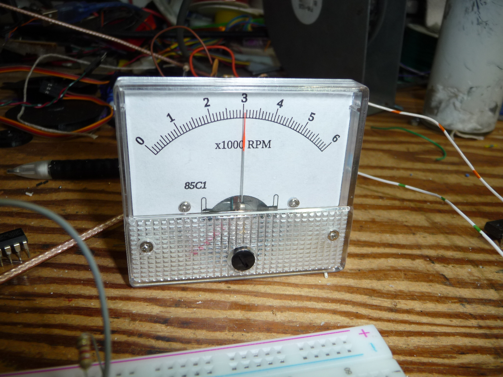

# 85C1
Art to make new scale for type 85 meter.

This is template art for you to make a new meter scale for a "size 85" meter (like the 85C1).
For linework and structured positioning, I suggest editing the dxf with a drafting program like librecad,
A program like inkscape can then take it and adjust the line weight and add formatted text.

good luck, I'd love to see what scales you make for your meters!
Maybe I can add it to the project? Build a library of strange custom scales?

HEY Remmeber that inkscape default prints at only 75 DPI!!
Adjust the settings to print at 600DPI.

  Rue M.
